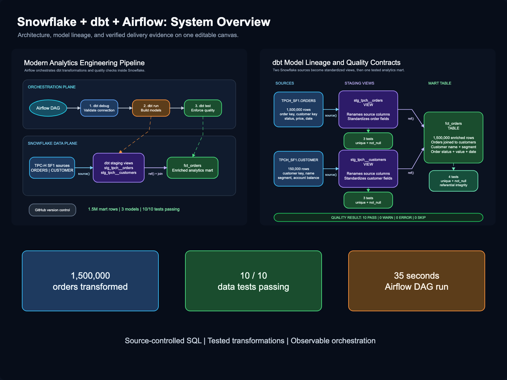
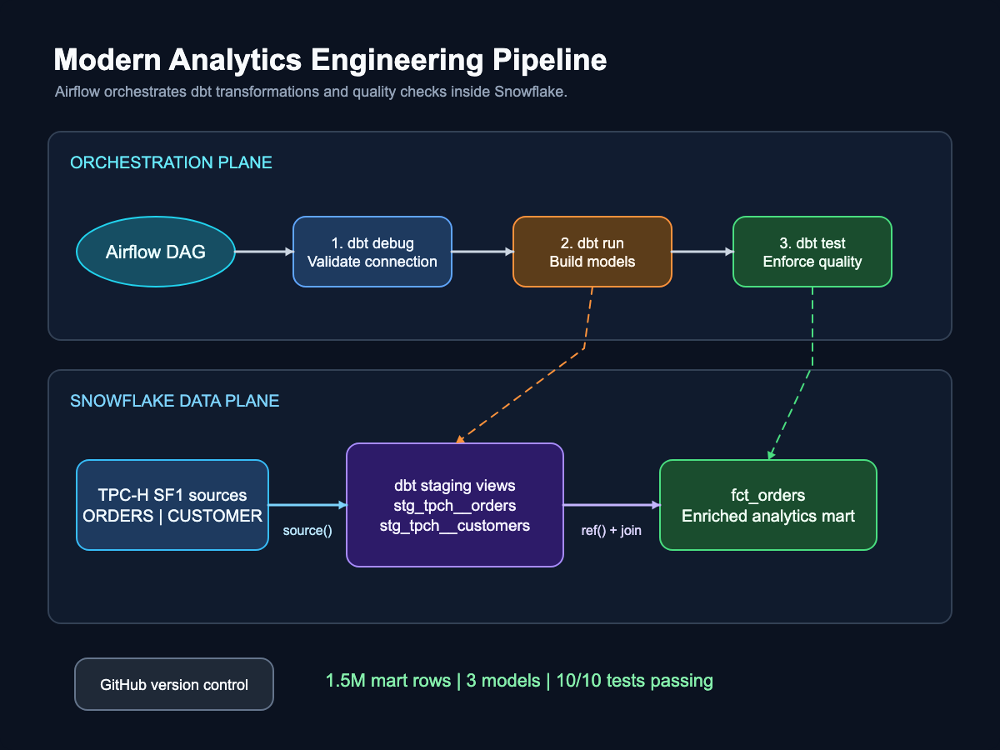
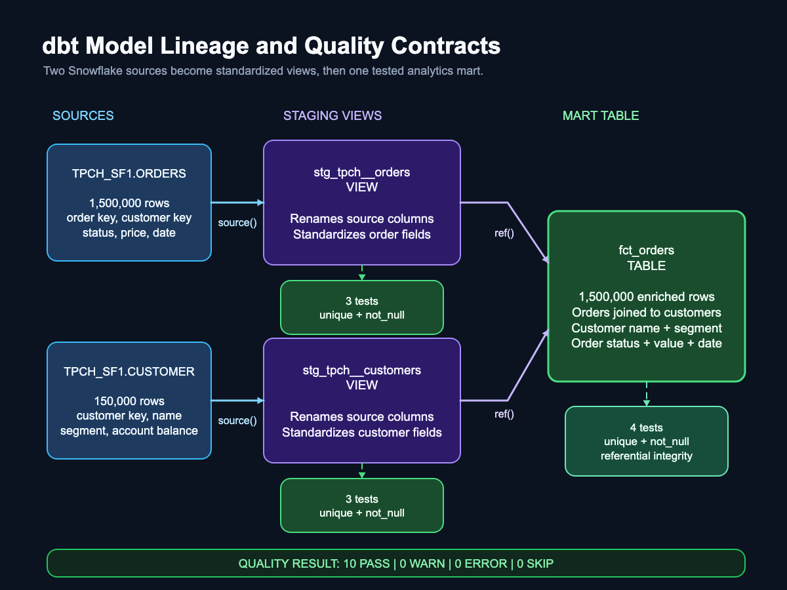
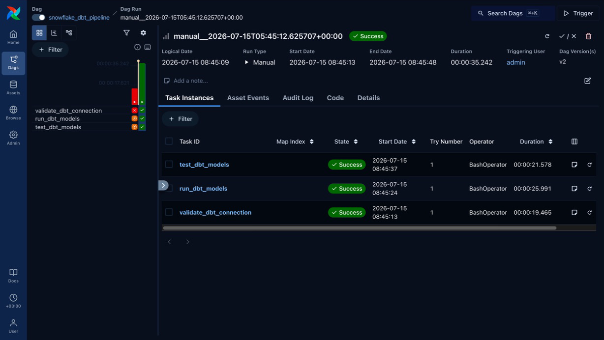

# Modern Snowflake, dbt, and Airflow Pipeline

An analytics engineering pipeline that transforms **1.5 million Snowflake TPC-H orders** into a tested customer-enriched mart, with dbt handling transformation and quality contracts and Airflow orchestrating the complete workflow.

**Stack:** Snowflake · dbt Core · Apache Airflow · SQL · Python · GitHub



## Problem

Raw warehouse tables are optimized for storage and source-system fidelity, not consistent downstream analysis. The TPC-H `ORDERS` and `CUSTOMER` tables use source-specific column names, have no project-level quality contracts, and require a repeatable join before analysts can work with customer-level order context.

This project builds that repeatable path:

1. Declare Snowflake tables as governed dbt sources.
2. Standardize raw columns in reusable staging views.
3. Join orders to customers in an analytics-ready fact table.
4. Test identifiers, required fields, and referential integrity.
5. Use Airflow to validate the connection, build models, and run tests in sequence.

## Evidence at a Glance

| Evidence | Verified result |
| --- | ---: |
| Snowflake source orders | 1,500,000 rows |
| Snowflake source customers | 150,000 rows |
| Enriched `fct_orders` mart | 1,500,000 rows |
| dbt resources | 2 sources, 3 models |
| Data-quality coverage | 10/10 tests passed |
| Airflow workflow | 3 dependent tasks succeeded |
| Observed local DAG run | 35.242 seconds |

The duration is evidence from one local manual run, not a performance benchmark.

## Architecture



The design separates two responsibilities:

- **Airflow orchestration plane:** runs `dbt debug`, `dbt run`, and `dbt test` as dependent tasks and exposes task-level status and logs.
- **Snowflake data plane:** stores the source tables, staging views, and final mart; dbt compiles and executes the SQL in the warehouse.
- **GitHub control plane:** versions the Snowflake setup, dbt models, tests, documentation, and Airflow DAG while excluding credentials and runtime artifacts.

The editable diagram is available in [`docs/diagrams/pipeline-architecture.excalidraw`](docs/diagrams/pipeline-architecture.excalidraw).

## Data Model and Lineage



| Model | Materialization | Input | Responsibility |
| --- | --- | --- | --- |
| [`stg_tpch__orders`](dbt/modern_snowflake_pipeline/models/staging/tpch/stg_tpch__orders.sql) | View | `TPCH_SF1.ORDERS` | Renames and standardizes order fields. |
| [`stg_tpch__customers`](dbt/modern_snowflake_pipeline/models/staging/tpch/stg_tpch__customers.sql) | View | `TPCH_SF1.CUSTOMER` | Renames and standardizes customer fields. |
| [`fct_orders`](dbt/modern_snowflake_pipeline/models/marts/fct_orders.sql) | Table | Both staging views | Enriches each order with customer name and market segment. |

The project uses dbt's `source()` and `ref()` functions instead of hard-coded transformation dependencies. This makes the lineage explicit and lets dbt build models in dependency order.

### Quality Contracts

Tests are defined beside the resources they protect:

- Staging orders: uniqueness and completeness of `order_id`, plus completeness of `customer_id`.
- Staging customers: uniqueness and completeness of `customer_id`, plus completeness of `customer_name`.
- Orders mart: uniqueness and completeness of `order_id`, completeness of `customer_id`, and customer referential integrity.

See [`_tpch__sources.yml`](dbt/modern_snowflake_pipeline/models/staging/tpch/_tpch__sources.yml) and [`_marts.yml`](dbt/modern_snowflake_pipeline/models/marts/_marts.yml) for the executable definitions.

## Orchestration Evidence



The [`snowflake_dbt_pipeline`](airflow/dags/snowflake_dbt_pipeline.py) DAG completed all tasks successfully:

```text
validate_dbt_connection
        ↓
run_dbt_models
        ↓
test_dbt_models
```

Airflow invokes the dbt executable from the project-level Python environment and passes explicit project and profile directories. A failure in validation or model building prevents downstream tasks from running against an invalid state.

## Repository Structure

```text
modern-snowflake-dbt-airflow-pipeline/
├── airflow/
│   └── dags/
│       └── snowflake_dbt_pipeline.py
├── dbt/
│   └── modern_snowflake_pipeline/
│       ├── models/
│       │   ├── staging/tpch/
│       │   │   ├── _tpch__sources.yml
│       │   │   ├── stg_tpch__customers.sql
│       │   │   └── stg_tpch__orders.sql
│       │   └── marts/
│       │       ├── _marts.yml
│       │       └── fct_orders.sql
│       └── dbt_project.yml
├── docs/
│   ├── diagrams/
│   └── images/
├── snowflake/
│   └── setup.sql
├── .gitignore
└── README.md
```

## How to Run

### 1. Clone the repository

```bash
git clone https://github.com/LukeOpany/modern-snowflake-dbt-airflow-pipeline.git
cd modern-snowflake-dbt-airflow-pipeline
```

### 2. Provision Snowflake objects

Open [`snowflake/setup.sql`](snowflake/setup.sql) in a Snowflake worksheet. Replace the username in the final `GRANT ROLE` statement with your own Snowflake username, then run the script with a role that can create warehouses, databases, schemas, and roles.

The script creates:

- `TRANSFORMING_WH`, an X-Small auto-suspending warehouse
- `ANALYTICS`, the project database
- `ANALYTICS.DBT_DEV`, the development schema
- `DBT_ROLE`, the least-privilege transformation role
- Access to `SNOWFLAKE_SAMPLE_DATA`

### 3. Install dbt

The tested local dbt environment uses Python 3.12.

```bash
python3.12 -m venv .venv
source .venv/bin/activate
python -m pip install --upgrade pip
python -m pip install dbt-snowflake==1.11.6
```

Create `~/.dbt/profiles.yml`:

```yaml
modern_snowflake_pipeline:
  target: dev
  outputs:
    dev:
      type: snowflake
      account: <organization-account>
      user: <username>
      password: "{{ env_var('SNOWFLAKE_PASSWORD') }}"
      role: DBT_ROLE
      database: ANALYTICS
      warehouse: TRANSFORMING_WH
      schema: DBT_DEV
      threads: 4
```

Export the password only in your local shell:

```bash
export SNOWFLAKE_PASSWORD='<your-password>'
```

Never commit `profiles.yml`, passwords, or generated Airflow credentials.

### 4. Build and test the dbt project

```bash
cd dbt/modern_snowflake_pipeline
dbt debug
dbt build
```

Expected resources:

```text
3 models
10 data tests
2 sources
```

### 5. Install and start Airflow

Return to the repository root, then create Airflow's separate environment:

```bash
cd ../../airflow
python3.14 -m venv .venv
source .venv/bin/activate

AIRFLOW_VERSION=3.3.0
PYTHON_VERSION=3.14
CONSTRAINT_URL="https://raw.githubusercontent.com/apache/airflow/constraints-${AIRFLOW_VERSION}/constraints-${PYTHON_VERSION}.txt"

python -m pip install --upgrade pip
python -m pip install "apache-airflow==${AIRFLOW_VERSION}" --constraint "${CONSTRAINT_URL}"
```

Start Airflow with the repository's DAG directory:

```bash
export AIRFLOW_HOME="$PWD/.airflow_home"
export AIRFLOW__CORE__DAGS_FOLDER="$PWD/dags"
export AIRFLOW__CORE__LOAD_EXAMPLES=False
airflow standalone
```

Open `http://localhost:8080`. The generated local credentials can be inspected with:

```bash
cat "$AIRFLOW_HOME/simple_auth_manager_passwords.json.generated"
```

Find `snowflake_dbt_pipeline`, enable it, and select **Trigger**. Keep the Airflow terminal running while the web interface is in use.

## Design Decisions

- **Views for staging:** preserve lightweight, inspectable source-standardization logic without duplicating data.
- **Table for the mart:** materializes the reusable order/customer join for predictable downstream reads.
- **Tests as code:** quality rules are versioned with the models and fail the orchestration visibly.
- **Separate Python environments:** dbt and Airflow retain independent dependency sets while the DAG points to the dbt executable explicitly.
- **Least-privilege Snowflake role:** transformation access is separated from account administration.
- **Runtime isolation:** `.venv`, `.airflow_home`, logs, compiled dbt artifacts, and credentials remain outside Git.

## What This Project Demonstrates

- Warehouse-first ELT using Snowflake compute and storage
- Modular SQL transformations and explicit lineage with dbt
- Automated uniqueness, completeness, and relationship testing
- Dependency-aware workflow orchestration and observability with Airflow
- Reproducible local environments and intentional Git hygiene
- Debugging across CLI paths, Python environments, warehouse permissions, and task logs

## Production Improvements

This repository is a working local portfolio implementation, not a production deployment. The next production-oriented steps would be:

- Add an ingestion task for an external operational source instead of relying on built-in Snowflake sample data.
- Add dbt source freshness checks and Airflow alerts.
- Run dbt build and SQL linting in GitHub Actions on pull requests.
- Replace password authentication with key-pair authentication and a managed secrets backend.
- Package Airflow in Docker or deploy it to a managed orchestration platform.
- Add separate development, CI, and production dbt targets.
- Publish dbt documentation and expose the mart to a BI layer.

## Visual Assets

The diagrams are versioned as editable Excalidraw files and scalable SVGs. See the [`docs/diagrams` index](docs/diagrams/README.md) for all source and preview links.

## Dataset

The project uses Snowflake's shared `SNOWFLAKE_SAMPLE_DATA.TPCH_SF1` dataset. The source data remains in Snowflake and is not copied into this repository.
