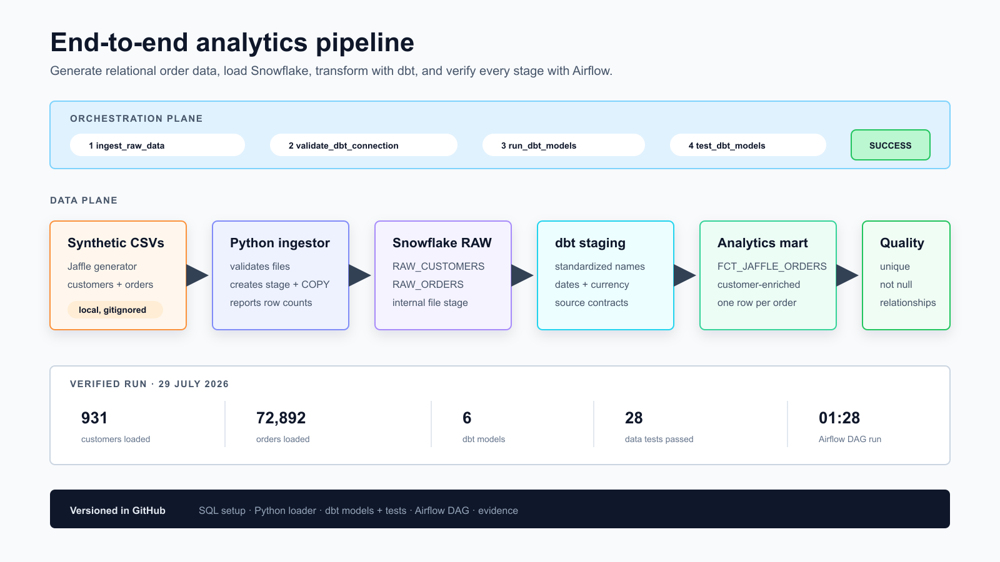
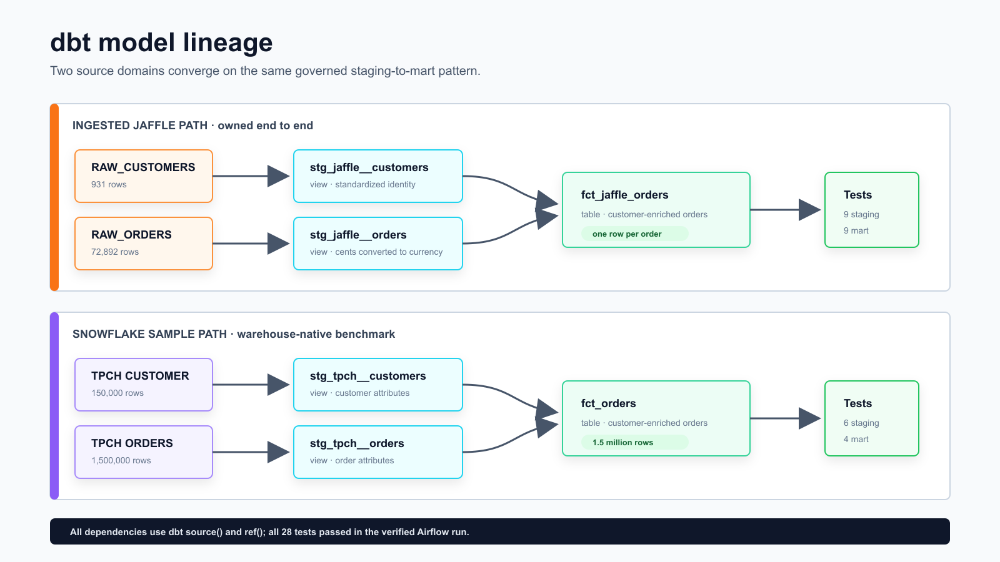
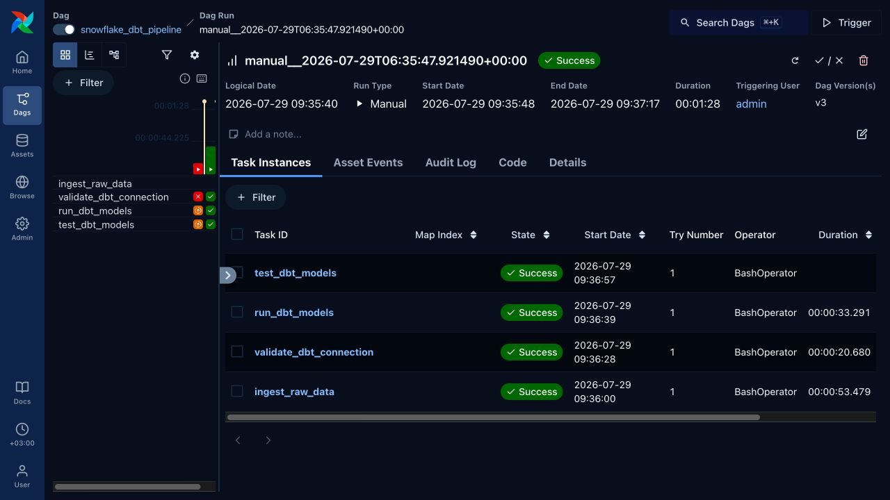

# Modern Snowflake, dbt, and Airflow Pipeline

An end-to-end analytics engineering pipeline that generates relational order data, bulk-loads it into Snowflake, transforms it with dbt, and orchestrates the complete workflow with Airflow. The project also retains a parallel 1.5-million-row TPC-H path to demonstrate warehouse-native modeling at a larger scale.

**Stack:** Snowflake · dbt Core · Apache Airflow · Python · SQL · GitHub



## Why This Exists

Operational files and warehouse source tables are not automatically analytics-ready. They arrive with source-specific names, raw monetary units, no quality contracts, and no reliable execution order.

This project solves that gap with a repeatable workflow:

1. Generate relational customer and order CSVs locally.
2. Validate and bulk-load the files into `ANALYTICS.RAW`.
3. Standardize columns, dates, and currency values in dbt staging views.
4. Build customer-enriched order marts.
5. Test identifiers, required fields, and relationships.
6. Orchestrate ingestion, transformation, and validation as one observable Airflow DAG.

## Verified Results

| Evidence | Result |
| --- | ---: |
| Jaffle customers loaded into `RAW_CUSTOMERS` | 931 |
| Jaffle orders loaded into `RAW_ORDERS` | 72,892 |
| Jaffle order-grain mart | 72,892 rows |
| TPC-H order-grain mart | 1,500,000 rows |
| dbt project | 4 sources, 6 models |
| Data-quality coverage | 28/28 tests passed |
| Airflow workflow | 4 dependent tasks succeeded |
| Verified local DAG run | 1 minute 28 seconds |

The Jaffle counts come from the loader's post-`COPY` verification queries. The mart preserves one row per unique order and joins to a customer source protected by uniqueness and relationship tests. The duration is evidence from one local manual run on 29 July 2026, not a performance benchmark.

## Architecture


- **Ingestion plane:** [`load_to_snowflake.py`](ingestion/load_to_snowflake.py) validates the generated files, creates a Snowflake file format and internal stage, uploads the files, executes `COPY INTO`, and reports loaded row counts.
- **Transformation plane:** dbt declares governed sources, builds staging views, materializes analytics marts, and executes 28 data tests.
- **Orchestration plane:** Airflow runs ingestion, connection validation, model building, and testing as a strict dependency chain.
- **Control plane:** GitHub versions the implementation while `.gitignore` excludes credentials, generated CSVs, virtual environments, Airflow state, logs, and compiled dbt artifacts.

Editable source: [`docs/diagrams/pipeline-architecture.excalidraw`](docs/diagrams/pipeline-architecture.excalidraw)

## Data Model and Lineage



### Ingested Jaffle Path

| Model | Materialization | Input | Responsibility |
| --- | --- | --- | --- |
| [`stg_jaffle__customers`](dbt/modern_snowflake_pipeline/models/staging/jaffle/stg_jaffle__customers.sql) | View | `ANALYTICS.RAW.RAW_CUSTOMERS` | Standardizes customer identity fields. |
| [`stg_jaffle__orders`](dbt/modern_snowflake_pipeline/models/staging/jaffle/stg_jaffle__orders.sql) | View | `ANALYTICS.RAW.RAW_ORDERS` | Standardizes order fields and converts cents to currency units. |
| [`fct_jaffle_orders`](dbt/modern_snowflake_pipeline/models/marts/jaffle/fct_jaffle_orders.sql) | Table | Both Jaffle staging views | Produces one customer-enriched row per order. |

### Snowflake TPC-H Path

| Model | Materialization | Input | Responsibility |
| --- | --- | --- | --- |
| [`stg_tpch__customers`](dbt/modern_snowflake_pipeline/models/staging/tpch/stg_tpch__customers.sql) | View | `TPCH_SF1.CUSTOMER` | Standardizes customer attributes. |
| [`stg_tpch__orders`](dbt/modern_snowflake_pipeline/models/staging/tpch/stg_tpch__orders.sql) | View | `TPCH_SF1.ORDERS` | Standardizes order attributes. |
| [`fct_orders`](dbt/modern_snowflake_pipeline/models/marts/fct_orders.sql) | Table | Both TPC-H staging views | Produces the 1.5-million-row customer-enriched order mart. |

All dependencies use dbt's `source()` and `ref()` functions, so lineage is explicit and dbt builds resources in dependency order.

### Quality Contracts

The 28 tests cover:

- Unique and non-null customer and order identifiers
- Required customer names, order dates, stores, and monetary values
- Order-to-customer referential integrity in staging and marts
- One-row-per-order expectations for both fact tables

Executable definitions live beside the resources in:

- [`_jaffle__sources.yml`](dbt/modern_snowflake_pipeline/models/staging/jaffle/_jaffle__sources.yml)
- [`_jaffle_marts.yml`](dbt/modern_snowflake_pipeline/models/marts/jaffle/_jaffle_marts.yml)
- [`_tpch__sources.yml`](dbt/modern_snowflake_pipeline/models/staging/tpch/_tpch__sources.yml)
- [`_marts.yml`](dbt/modern_snowflake_pipeline/models/marts/_marts.yml)

## Orchestration Evidence



The [`snowflake_dbt_pipeline`](airflow/dags/snowflake_dbt_pipeline.py) DAG completed version 3 successfully:

```text
ingest_raw_data
        ↓
validate_dbt_connection
        ↓
run_dbt_models
        ↓
test_dbt_models
```

Each task is a failure boundary. Bad credentials or malformed input stop ingestion; a failed dbt connection prevents model execution; model failures prevent tests from presenting a false green result.

## Repository Structure

```text
modern-snowflake-dbt-airflow-pipeline/
├── airflow/
│   └── dags/snowflake_dbt_pipeline.py
├── data/
│   └── jaffle-data/                  # generated CSVs, ignored by Git
├── ingestion/
│   └── load_to_snowflake.py
├── dbt/
│   └── modern_snowflake_pipeline/
│       ├── models/
│       │   ├── staging/
│       │   │   ├── jaffle/
│       │   │   └── tpch/
│       │   └── marts/
│       │       ├── jaffle/
│       │       └── fct_orders.sql
│       └── dbt_project.yml
├── docs/
│   ├── diagrams/
│   └── images/
├── snowflake/
│   ├── setup.sql
│   └── raw_setup.sql
├── .gitignore
└── README.md
```

## Run It Locally

### 1. Clone and create the dbt environment

```bash
git clone https://github.com/LukeOpany/modern-snowflake-dbt-airflow-pipeline.git
cd modern-snowflake-dbt-airflow-pipeline

python3.12 -m venv .venv
source .venv/bin/activate
python -m pip install --upgrade pip
python -m pip install dbt-snowflake==1.11.6 snowflake-connector-python
```

### 2. Provision Snowflake

Run [`snowflake/setup.sql`](snowflake/setup.sql), then [`snowflake/raw_setup.sql`](snowflake/raw_setup.sql), in a Snowflake worksheet using a role that can create and grant the required objects.

This creates or configures:

- `TRANSFORMING_WH`
- `ANALYTICS.DBT_DEV`
- `ANALYTICS.RAW`
- `DBT_ROLE`
- Access to `SNOWFLAKE_SAMPLE_DATA`

Create `~/.dbt/profiles.yml`:

```yaml
modern_snowflake_pipeline:
  target: dev
  outputs:
    dev:
      type: snowflake
      account: <organization-account>
      user: <username>
      password: "{{ env_var('SNOWFLAKE_PASSWORD') }}"
      role: DBT_ROLE
      database: ANALYTICS
      warehouse: TRANSFORMING_WH
      schema: DBT_DEV
      threads: 4
```

### 3. Generate the ingestion files

From the repository root:

```bash
cd data
pipx run jafgen 1 --pre source
cd ..
```

The generated CSVs remain local because `data/**/*.csv` is ignored by Git.

### 4. Export local credentials

```bash
export SNOWFLAKE_ACCOUNT='<organization-account>'
export SNOWFLAKE_USER='<username>'
export SNOWFLAKE_PASSWORD='<password>'
```

Never commit these values, `profiles.yml`, or Airflow-generated credentials.

### 5. Run ingestion and dbt directly

```bash
python ingestion/load_to_snowflake.py

cd dbt/modern_snowflake_pipeline
dbt debug
dbt build
```

Expected dbt resources:

```text
4 sources
6 models
28 data tests
```

### 6. Run the complete workflow in Airflow

The tested Airflow environment uses Python 3.14:

```bash
cd ../../../airflow
python3.14 -m venv .venv
source .venv/bin/activate

AIRFLOW_VERSION=3.3.0
PYTHON_VERSION=3.14
CONSTRAINT_URL="https://raw.githubusercontent.com/apache/airflow/constraints-${AIRFLOW_VERSION}/constraints-${PYTHON_VERSION}.txt"

python -m pip install --upgrade pip
python -m pip install "apache-airflow==${AIRFLOW_VERSION}" --constraint "${CONSTRAINT_URL}"
```

Start Airflow from the same terminal that contains the Snowflake environment variables:

```bash
export AIRFLOW_HOME="$PWD/.airflow_home"
export AIRFLOW__CORE__DAGS_FOLDER="$PWD/dags"
export AIRFLOW__CORE__LOAD_EXAMPLES=False
airflow standalone
```

Open `http://localhost:8080`, enable `snowflake_dbt_pipeline`, and select **Trigger**. Local credentials are available with:

```bash
cat "$AIRFLOW_HOME/simple_auth_manager_passwords.json.generated"
```

## Design Decisions

- **Bulk load instead of row inserts:** `PUT` plus `COPY INTO` uses Snowflake's native ingestion path and scales better than issuing one insert per record.
- **Idempotent local runs:** raw tables and the internal stage are cleared before reload, so repeated portfolio runs produce a known state.
- **Views for staging:** source standardization stays lightweight and inspectable.
- **Tables for marts:** reusable joins are materialized for predictable downstream reads.
- **Tests as code:** quality rules are versioned with models and fail visibly in orchestration.
- **Separate Airflow environment:** orchestration dependencies remain isolated while the DAG invokes the project-level dbt and Python executables explicitly.
- **Least-privilege role:** ingestion and transformation use `DBT_ROLE`, not `ACCOUNTADMIN`.
- **Intentional Git hygiene:** secrets, runtime state, generated data, and compiled artifacts never enter source control.

## What This Demonstrates

- Python-based batch ingestion into Snowflake
- Warehouse-first ELT with native staging and bulk copy
- Modular SQL transformations and explicit dbt lineage
- Automated uniqueness, completeness, and relationship testing
- Dependency-aware Airflow orchestration with task-level observability
- Reproducible local environments and disciplined Git workflows
- Debugging across paths, Python environments, authentication, Snowflake permissions, and task logs

## Production Improvements

This is a working local portfolio implementation. A production evolution would:

- Land immutable source files in object storage and track ingestion metadata
- Replace truncate-and-reload with incremental or merge-based processing
- Add source freshness checks, retries, alerting, and dead-letter handling
- Use key-pair authentication and a managed secrets backend
- Run dbt build, Python tests, and SQL linting in CI
- Deploy Airflow to containers or a managed orchestration platform
- Separate development, CI, and production dbt targets
- Publish dbt documentation and expose marts through a BI layer

## Visual Assets

The diagrams are versioned as editable Excalidraw files, scalable SVGs, and GitHub-ready PNGs. See the [`docs/diagrams` index](docs/diagrams/README.md).

## Datasets

- **Jaffle generator:** synthetic local customer and order CSVs used to exercise the full ingestion path.
- **Snowflake TPC-H SF1:** shared warehouse data used to demonstrate higher-volume dbt transformation.

Generated CSVs and Snowflake source data are intentionally not committed to this repository.
